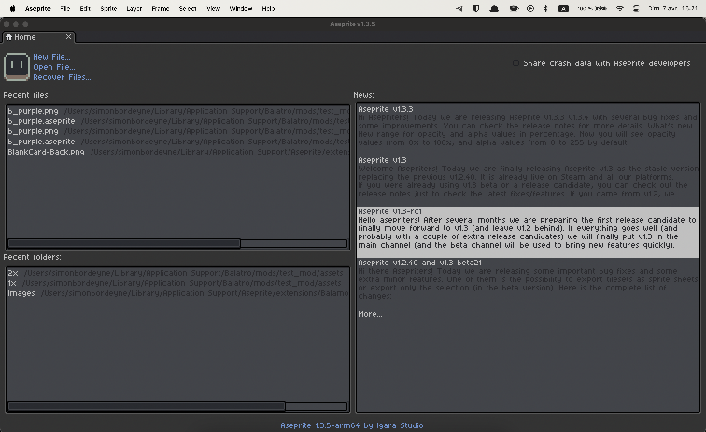
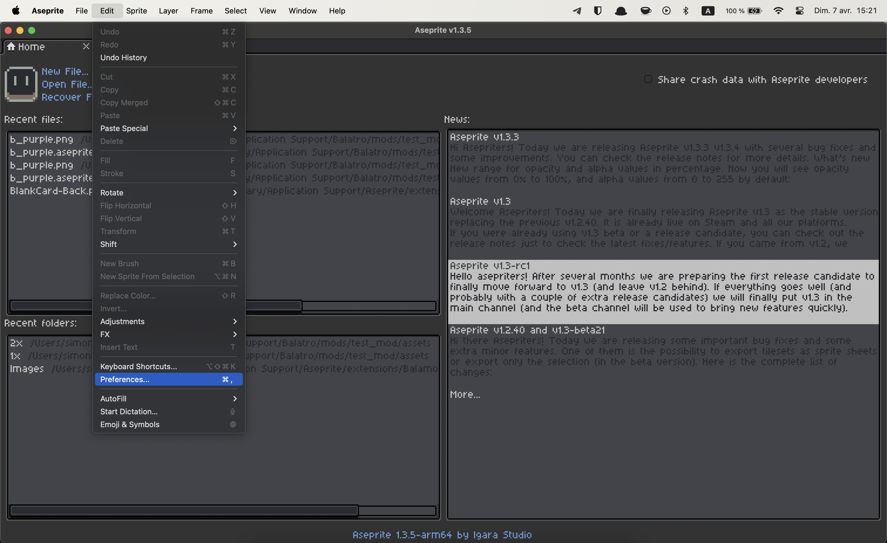
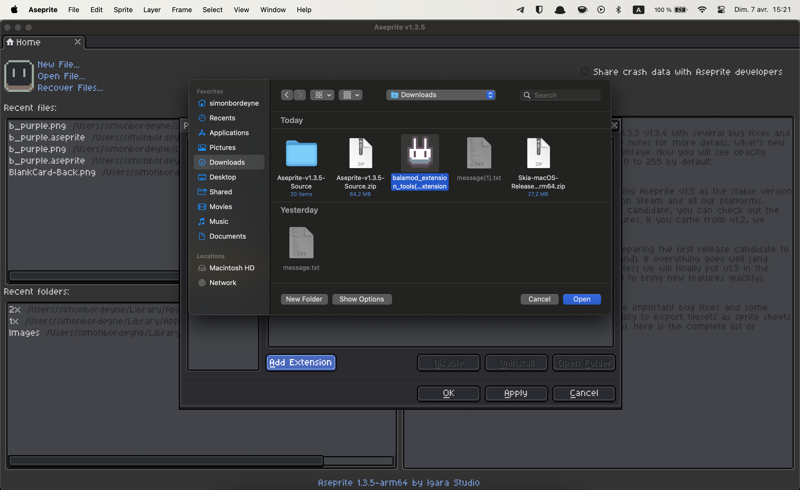

# Aseprite

Aseprite is a free and open-source spriting software that is very popular amongst
indie game developers thanks to its ease of use and extensibility

## Integration with balamod

The balamod contributors made an extension for aseprite in order to more easily
make sprites for Balatro, respecting the existing color palettes, and format for
jokers, consumables, vouchers and so on.

## Installation of the balamod extension

First, download the latest extension from the [releases](https://github.com/balamod/aseprite-balamod-extension/releases/latest).

Install the extension by going into `Edit > Preferences > Extensions` and click the `Add Extension` button.
Select the `balamod_extension_tools.aseprite-extension` from the file explorer, then click `Cancel`

It should be installed !

*Aseprite User Interface*

*Preferences menu option*

*Extension preferences, click on add extension*

*Select the balamod_extension_tools.aseprite-extension file*

*Extension installed, click on cancel*

*Click on OK to validate the changes*
